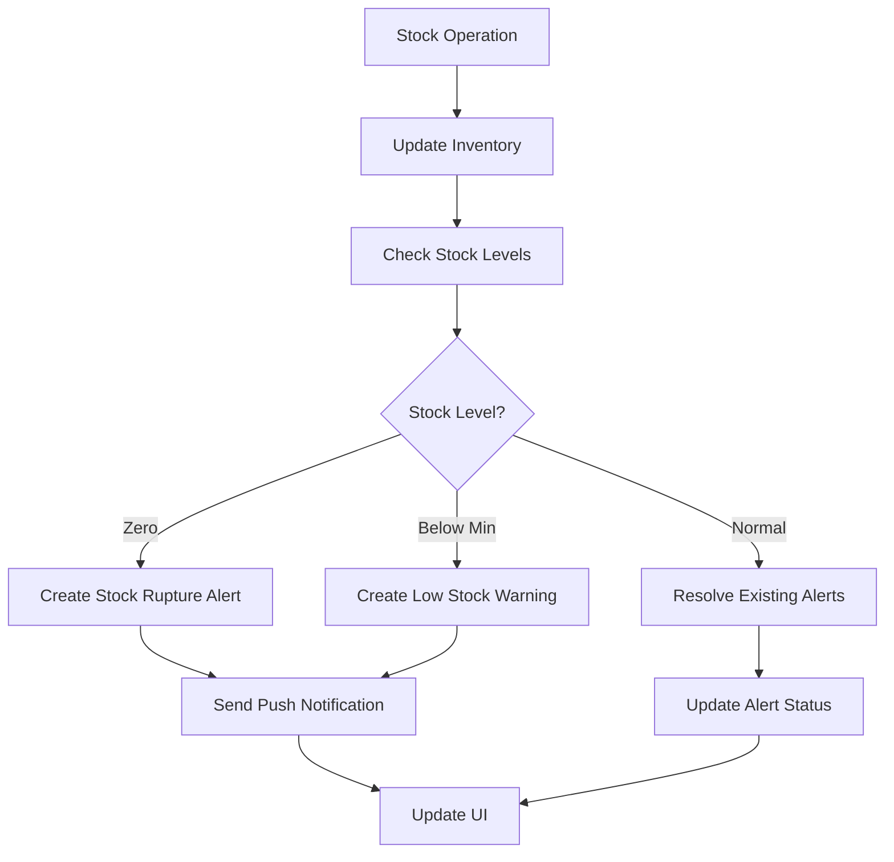
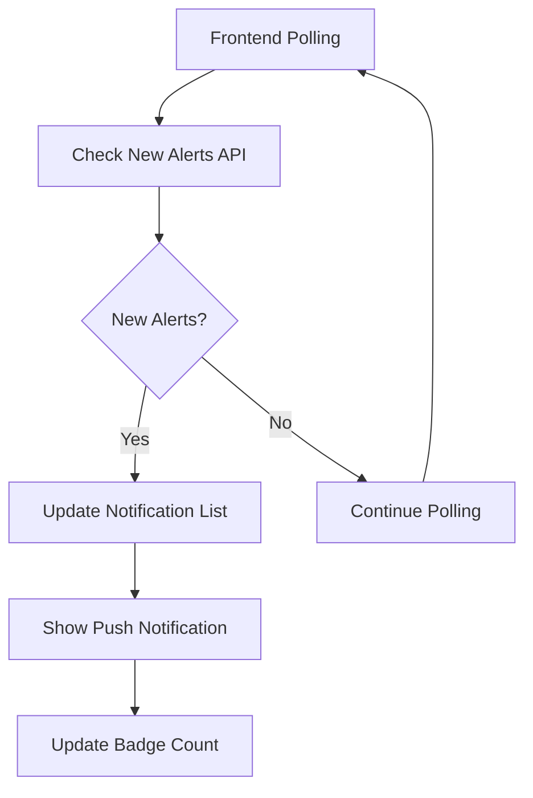

# 📢 Stock Management Notification System

A comprehensive notification system for real-time stock monitoring, warnings, and alerts (rupture de stock) with push notifications.

## 🚀 Features

### ✨ Core Features
- **Real-time Stock Monitoring** - Automatic detection of low stock and out-of-stock situations
- **Push Notifications** - Browser-based push notifications for immediate alerts
- **Smart Alerts** - Intelligent notification system that prevents spam by limiting duplicate alerts
- **Multi-priority System** - High priority for stock rupture, medium for low stock warnings
- **Rich UI** - Beautiful notification center with detailed stock information
- **Auto-resolution** - Notifications automatically resolve when stock is replenished

### 🎯 Notification Types
1. **Stock Rupture Alert** (🚨 High Priority)
   - Triggered when stock reaches zero
   - Immediate action required
   - Red color coding for urgent attention

2. **Low Stock Warning** (⚠️ Medium Priority)
   - Triggered when stock falls below minimum threshold
   - Preventive alert for restocking
   - Orange color coding for attention

3. **Stock Resolution** (✅ Auto)
   - Automatically marks alerts as resolved when stock is replenished
   - Keeps notification history clean

## 🏗️ Architecture

### Backend Components
- **`/routes/notifications.js`** - API endpoints for notification management
- **`/routes/inventory.js`** - Enhanced with automatic notification triggers
- **`/scripts/setup-notifications.js`** - Database setup script

### Frontend Components
- **`/services/notificationService.ts`** - Notification service singleton with polling
- **`/components/NotificationCenter.tsx`** - Main notification UI component
- **Enhanced stock components** - Integrated with notification system

### Database Tables
- **`notifications`** - Stores all notifications with rich metadata
- **`notification_settings`** - User-specific notification preferences

## 📦 Installation

### 1. Setup Database Tables
```bash
cd backend
node scripts/setup-notifications.js
```

### 2. Install Dependencies
Frontend and backend dependencies should already be installed. The notification system uses existing packages.

### 3. Start Services
```bash
# Backend
cd backend
npm start

# Frontend
cd frontend
npm start
```

## 🎮 Usage

### For Users

#### Viewing Notifications
1. **Notification Icon**: Click the bell icon in the top navigation
2. **Badge Count**: Shows number of unread notifications
3. **Color Coding**: Red bell indicates critical stock alerts
4. **Real-time Updates**: Notifications refresh automatically every 30 seconds

#### Managing Notifications
- **Mark as Read**: Click on individual notifications
- **Mark All Read**: Use the "Mark All Read" button
- **Delete**: Remove individual notifications
- **View Details**: Click notifications to see full product details

#### Browser Notifications
- **Permission**: System will request browser notification permission
- **Push Alerts**: Receive browser notifications even when tab is not active
- **Smart Deduplication**: Prevents multiple notifications for the same product

### For Administrators

#### Manual Trigger
- Use the "Refresh" button in notification center to manually check for stock alerts
- Useful for immediate verification after stock operations

#### Stock Operations Integration
- Notifications automatically trigger after:
  - Stock In operations
  - Stock Out operations  
  - Stock Adjustments
  - Product creation/editing

## 🔧 API Endpoints

### Notification Management
```typescript
GET    /api/notifications          // Get user notifications
GET    /api/notifications/stats    // Get notification statistics
PATCH  /api/notifications/:id/read // Mark notification as read
PATCH  /api/notifications/mark-all-read // Mark all as read
DELETE /api/notifications/:id      // Delete notification

// Stock-specific endpoints
GET    /api/notifications/check-stock-alerts // Check for new alerts
POST   /api/notifications/low-stock          // Trigger stock alerts
```

### Notification Settings
```typescript
GET    /api/notifications/settings // Get user preferences
PUT    /api/notifications/settings // Update preferences
```

## ⚙️ Configuration

### Notification Settings
Users can configure:
- **Email Notifications**: Enable/disable email alerts
- **SMS Notifications**: Enable/disable SMS alerts (future)
- **Push Notifications**: Enable/disable browser push notifications
- **Stock Alerts**: Master toggle for all stock notifications
- **Low Stock Threshold**: Custom threshold per user
- **Auto Stock Alerts**: Enable/disable automatic monitoring

### System Configuration
```javascript
// Polling interval (frontend)
const POLLING_INTERVAL = 30000; // 30 seconds

// Duplicate prevention (backend)
const ALERT_COOLDOWN = 1; // hour

// Notification retention
// Notifications are kept indefinitely but can be deleted by users
```

## 🔄 Workflow

### Automatic Stock Monitoring


### Real-time Updates


## 📊 Database Schema

### Notifications Table
```sql
CREATE TABLE notifications (
    id INTEGER PRIMARY KEY AUTOINCREMENT,
    user_id INTEGER NOT NULL,
    type VARCHAR(50) NOT NULL,           -- 'stock_alert', 'stock_warning'
    title VARCHAR(255),                  -- Display title
    message TEXT NOT NULL,               -- Notification message
    priority VARCHAR(20) DEFAULT 'medium', -- 'low', 'medium', 'high'
    data TEXT,                          -- JSON metadata
    status VARCHAR(20) DEFAULT 'active', -- 'active', 'read', 'resolved'
    created_at DATETIME DEFAULT CURRENT_TIMESTAMP,
    read_at DATETIME,
    FOREIGN KEY (user_id) REFERENCES users (id)
);
```

### Sample Data JSON
```json
{
  "product_id": 123,
  "product_name": "Premium Coffee Beans",
  "sku": "COFFEE-001",
  "current_stock": 0,
  "min_stock_level": 10,
  "category": "Beverages",
  "supplier": "Coffee Supreme Ltd",
  "stock_status": "out_of_stock",
  "triggered_by": "stock_operation"
}
```

## 🧪 Testing

### Manual Testing
1. **Create Low Stock Product**:
   ```javascript
   // Set minimum stock to 10, current stock to 5
   // Should trigger low stock warning
   ```

2. **Create Out of Stock**:
   ```javascript
   // Set current stock to 0
   // Should trigger stock rupture alert
   ```

3. **Stock Replenishment**:
   ```javascript
   // Add stock back above minimum
   // Should resolve existing alerts
   ```

### Automated Testing
```bash
# Test notification endpoints
npm test -- notifications.test.js

# Test stock integration
npm test -- stock-notifications.test.js
```

## 🎨 UI Components

### NotificationCenter Props
```typescript
interface NotificationCenterProps {
  variant?: 'fab' | 'button' | 'icon';     // Display style
  showBadge?: boolean;                      // Show unread count
  onNotificationClick?: (notification: Notification) => void; // Click handler
}
```

### Usage Examples
```tsx
// In navigation bar
<NotificationCenter variant="icon" showBadge={true} />

// As floating action button
<NotificationCenter variant="fab" />

// As menu button
<NotificationCenter 
  variant="button" 
  onNotificationClick={(notification) => {
    // Handle notification click
    navigate(`/products/${notification.data.product_id}`);
  }}
/>
```

## 🔮 Future Enhancements

### Planned Features
- **Email Notifications**: SMTP integration for email alerts
- **SMS Notifications**: Twilio integration for SMS alerts
- **Slack Integration**: Send alerts to Slack channels
- **Custom Thresholds**: Per-product minimum stock levels
- **Notification Templates**: Customizable message templates
- **Batch Operations**: Bulk notification management
- **Analytics Dashboard**: Notification metrics and insights
- **Webhook Support**: External system integration

### Advanced Features
- **AI-Powered Predictions**: Predictive stock shortage alerts
- **Supply Chain Integration**: Automatic reorder suggestions
- **Multi-language Support**: Notifications in multiple languages
- **Mobile App Push**: React Native mobile notifications

## 🐛 Troubleshooting

### Common Issues

#### Notifications Not Appearing
1. Check browser notification permissions
2. Verify polling is active in browser console
3. Check network connection to backend
4. Verify user authentication

#### Push Notifications Not Working
1. Ensure HTTPS or localhost (required for push notifications)
2. Check browser support for Notification API
3. Verify permission granted in browser settings

#### Duplicate Notifications
- System prevents duplicates within 1-hour window
- Clear existing notifications if needed
- Check database for orphaned records

#### Performance Issues
- Notifications are paginated (20 per request)
- Polling interval can be adjusted
- Database indexes ensure fast queries

### Debug Mode
```javascript
// Enable debug logging
localStorage.setItem('notifications_debug', 'true');

// View polling status
console.log(notificationService.getNotifications());
```

## 📞 Support

For technical support or feature requests:
1. Check this documentation
2. Review browser console for errors
3. Check backend logs for API issues
4. Verify database schema is up to date

## 📄 License

This notification system is part of the Stock Management System and follows the same license terms.

---

**🎉 Enjoy smooth, real-time stock notifications! No more stock ruptures will go unnoticed!**